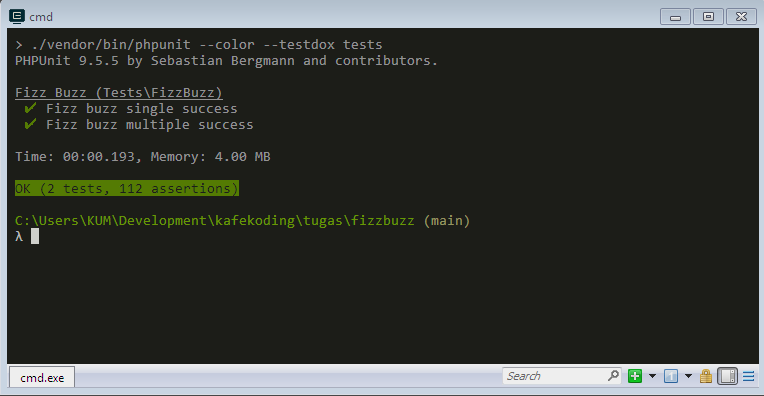

# Latihan Fizz Buzz PHP Dasar Kafekoding

Latihan ini merupakan latihan yang akan dijalankan setelah mempelajari materi PHP Dasar tentang 'control structure'. Pada PHP kelas kafekoding, latihan dilaksanakan menggunakan sebagai evaluasi terhadap peserta.

Latihan dikumpulkan di classroom di link berikut. 

## Konsep 

Merupakan sebuah permainan yang dimainkan menggunakan angka, sederhananya kita akan menyebutkan sebuah angka, jika angka tersebut habis dibagi tiga, maka dari pada menyebutkan tiga kita menggantinya dengan 'Fizz', jika angka tersebut habis dibagi lima, kita menggantinya dengan 'Buzz' dan apabila angka tersebut habis dibagi dengan tiga dan lima, maka diganti dengan 'FizzBuzz'.

Biasanya permainan ini sering dijadikan salah satu test wawancara tahap awal ketika melamar pekerjaan di bidang programming.

Contoh : 
```
1, 2, Fizz, 4, Buzz, Fizz, 7, 8, Fizz, Buzz, 11, Fizz, 13, 14, Fizz Buzz, 16, 17, Fizz, 19, Buzz, Fizz, 22, 23, Fizz, Buzz, 26, Fizz, 28, 29, Fizz Buzz, ...
```

Untuk soal kali ini, diminta membuat list dari angka 1 - 100. Kirimkan file koding dalam bentuk file .php ke classroom.

## Pengetesan Latihan

Repositori ini merupakan repositori yang bisa digunakan untuk melakukan pengetesan terhadap kode dari para peserta.

### Bekerja di mesin lokal

Clone repositori ke workspace masing masing dan install dependency,
```bash
git clone https://github.com/azharisikumbang/kafekoding-fizzbuzz.git
cd kafekoding-fizzbuzz
composer install
composer test
```

### Membuat kode

Latihan dilakukan dengan langsung mengimplementasikan testing. Pada folder latihan kita akan bekerja dengan file `tests\FizzBuzzTest.php`, pada file tersebut kita bekerja dengan membuat kode agar test bisa dilewati alias `passed`. Terdapat dua jenis test, yaitu :

1. Test untuk single fizz buzz
Test ini bertujuan untuk membuat pengujian fizzbuzz terhadap sebuah angka.

```php
/** @test */
public function fizz_buzz_single_success()
{
   $this->assertEquals(1, $this->fizzBuzzSingle(1));
   $this->assertEquals(8, $this->fizzBuzzSingle(8));
   ...
   ...
}
```

Agar test tersebut bisa dilewati, peserta bisa mulai mengimplimentasika kode pada method berikut, 

```php
protected function fizzBuzzSingle(int $number)
{
	// implementasi kode fizz buzz untuk satu angka
}
```

2. Test untuk multiple fizz buzz
Test ini bertujuan untuk membuat pengujian fizzbuzz banyak angka sekaligus dengan menggunakan range tertentu.

```php
/** @test */
public function fizz_buzz_multiple_success()
{
	...
}	
```

Agar test tersebut bisa dilewati, peserta bisa mulai mengimplimentasika kode pada method berikut, 

```php
protected function fizzBuzzMultiple(int $end, int $start = 1)
{
	// implementasi kode fizz buzz untuk beberapa angka, dari range $start - $end
}
```

Agar test bisa dilakukan secara optimal, diharuskan untuk melewati test `fizz_buzz_single_success()` terlebih dahulu.

## Run Test

Setelah mengimplementasikan kode, silahkan test kode yang telah kita buat. Pastikan kedua test passed.



## Informasi

KafeKoding adalah sebuah komunitas yang berada di STMIK Indonesia Padang yang berdiri pada 1 Agustus 2013, saat ini KafeKoding memiliki beberapa kelas seperti Database, HTML-CSS, Bootstrap, Python Dasar, Intermediate Python, PHP Dasar, Laravel, Design Grafis. Selengkapnya cek di [kafekoding.web.id](http://kafekoding.web.id/)
